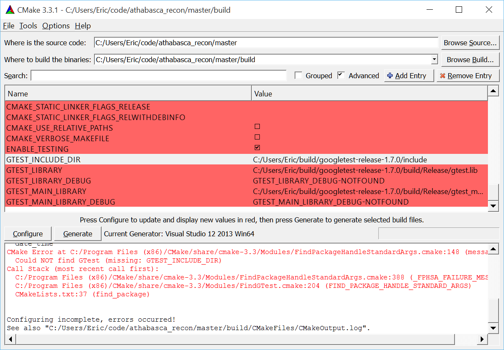

Athabasca Recon Manual
======================
Eric Nodwell <eric.nodwell@numerics88.com>; Steven K Boyd <skboyd@ucalgary.ca>
:revision: 1.3
:edition: 1.3
:doctype: book
:toc: left
:stem: latexmath
:icons:
:numbered:
:copyright: Copyright (c) 2011-2015, Eric Nodwell

//////////////////////////////////////////
NOTES:

Heading Capitalization:
Top level headings have all words capitalized;
Lower level headings have sentence capitalization.

Greek letters:
See the comment and the table below.

//////////////////////////////////////////

//////////////////////////////////////////
The following is the an asciidoc normal attribute,
used to simplify the coloration of C++ code.
See http://www.methods.co.nz/asciidoc/faq.html#_one_liner_ifdef_s_are_disproportionately_verbose_can_they_shortened
for more info
:cpp: {basebackend@docbook:c++:cpp}
//////////////////////////////////////////

//////////////////////////////////////////
Table of attributes (i.e. variables) for Greek letters and special characters.

This makes things a bit more readable.
Example usage: {nu}
See http://www.methods.co.nz/asciidoc/faq.html#_can_i_include_html_and_xml_character_entity_references_in_my_document
and
http://en.wikipedia.org/wiki/List_of_XML_and_HTML_character_entity_references
//////////////////////////////////////////
:alpha: &#945;
:epsilon: &#949;
:nu: &#957;
:rho: &#961;
:sigma: &#963;
:times: &#215;
:Delta: &#916;

ifdef::basebackend-html[]
*******************************************************************
Copyright (c) 2011-2015, Eric Nodwell

http://numerics88.com/
*******************************************************************
endif::basebackend-html[]

About Athabasca Recon
---------------------

Athabasca Recon is a program for CT reconstruction using filtered back-projection.  It has the following features:

*Precise*.  Athabasca Recon includes an ImageJ plug-in for optimal alignment of the input projections.  It allows you to identify and correct even tiny errors in the center of rotation or the rotation axis.  Athabasca Recon also implements a number of methods to correct for beam power decay.

*Fast*. It is fully multi-threaded, and makes full use of all available processing cores.

*Memory efficient*. Athabasca Recon will use as much memory as you
specify (defaults to slightly less than the amount of physical system memory), but
is not limited at all in the size of models in can reconstruct, regardless
of the memory limit.  Projection data are streamed and never loaded
all into memory at once, reducing the required memory.

*Cross-platform*. It has been compiled on OS X, Linux and Windows.

Because it was created to process synchrotron tomographic data, it currently only handles parallel beam reconstruction.

The home page for Athabasca Recon is http://numerics88.github.io/athabasca_recon/ .

Athabasca Recon was originally developed by Eric Nodwell
at the Bone Imaging Laboratory,
University of Calgary (http://bonelab.ucalgary.ca/) under the supervision
of Dr. Steven K. Boyd for the purpose of processing data synchrotron
data obtained at the Canadian Light Source. It is now supported and
maintained by Numerics88 Solutions Ltd. (http://numerics88.com./)

License
-------

Athabasca Recon is licensed under GPL version 2.  Here is the
standard licensing statement that goes with it:

..............................................
This program is free software: you can redistribute it and/or modify
it under the terms of the GNU General Public License as published by
the Free Software Foundation, either version 2 of the License, or
(at your option) any later version.

This program is distributed in the hope that it will be useful,
but WITHOUT ANY WARRANTY; without even the implied warranty of
MERCHANTABILITY or FITNESS FOR A PARTICULAR PURPOSE.  See the
GNU General Public License for more details.

You should have received a copy of the GNU General Public License
along with this program.  If not, see <http://www.gnu.org/licenses/>.
..............................................

The complete text of the license is in the file +LICENSE.txt+, distributed
with the source code.

We are interested to know who is using this software. Feel free to
drop us a line at one of the above email addresses

Definitions and conventions
---------------------------

[[geometry_and_coordinate_system]]
=== Geometry and coordinate systems

The following figure shows the defined geometry and coordinate systems, as
viewed from above (_z_ and _v_ are up in this figure).

ifndef::basebackend-html[]
image::images/basic_geometry.pdf[]
endif::basebackend-html[]
ifdef::basebackend-html[]

endif::basebackend-html[]

NOTE:  For the direction of
rotation, the above convention is equivalent to the following: as you scroll forward through your projections, you
should have the impression of walking to your right around the object.
However, for parallel projections, it isn't possible to distinguish
"walking to the right around the object" from "walking to the left around
a mirror image of the object".  So getting the direction of rotation
incorrect for parallel rotations merely mirrors the reconstructed image.
For cone beam however, getting the direction of rotation incorrect
results in severe distortion in the reconstruction.

Vector values, written as number tuples, are denoted in the order
(_x_,_y_,_z_) for volume, and (_u_,_v_) for projections.

NOTE: Internally, Athabasca Recon consistently uses (_z_,_y_,_x_) and
(_v_,_u_), in accordance with the fastest-changing index by memory
address being last.  This however is relevant only for developers; users do
not need to be aware of this.

Pixels (and their 3D counterparts Voxels) have a finite size, which inevitably
leads to the question, "Is the position of pixels denoted by their lower-left
corners, or by their centers?"  Here we using
the center-of-the-pixel convention.  Thus the origin of the projections
will give the _center_ position of the pixel with index (0,0), and the
origin of the reconstruction volume will be the _center_ of the voxel with index(0,0,0).  This convention is perhaps more commonly
used than the other one when dealing with images.  Be aware however, that it has the disadvantage
that the numerical value of the origin changes if the pixel/voxel size
is changed (as happens if for example you decimate or bin the data to reduce the data size
and the resolution).  Unfortunately, ImageJ uses a pixel-corner-as-the-origin
convention.  You'll just have to add/subtract half a pixel when using ImageJ
to compute values such as the center of mass.

NOTE: The above image is drawn with a "origin is the lower left of image" convention.  
(Not to be confused with the convention of giving pixel coordinates from the corner or the edge, which is a different issue.)
Be
aware that most image viewing software places the image origin at the _upper_
left corner.  This results in
the projections, and possibly the reconstructed volume, appearing as an inverted
image.  Most detectors work similarly, but we don't, because we're fond of right-handed coordinate systems.

=== Units

The only units that are used in Athabasca Recon are units of length.  No
particular units are assumed; rather length units are used consistently.
Hence if you specify a numerical value for the projection pixel size in
microns for example, you must also use microns for the voxel size, and
the resulting reconstruction attenuation densities will have units of inverse
microns.  This may be inconvenient, as for example, the usual units for
attenuation density is inverse cm.  However, the output can be scaled;
see <<Reconstruction_ScalingFactor,Reconstruction.ScalingFactor>>.

Running Athabasca Recon
-----------------------

I'm going to jump right in to showing how to do simple reconstructions
with Athabasca Recon.

In order to follow along, you will need to install ImageJ and some plug-ins.
That is described in the section <<imagej_and_data_file_formats,ImageJ and data file formats>>.

Configuration file
~~~~~~~~~~~~~~~~~~

The execution of +athabasca_recon+ is controlled with a configuration file,
which must be specified when it is run, like this:

---------------------------------------------------------------------
athabasca_recon recon.conf
---------------------------------------------------------------------

The configuration file has a simple structure and can be created and edited
with any text editor.  It can also be given any extension.  I prefer to
use +.conf+, but this is not required.  Here is a simple example of a configuration file:

---------------------------------------------------------------------
# Example minimal configuration file (recon.conf)

[Input]
RawProjectionsFile = projections.mhd
DarkFieldFile = projections-dark.mhd
BrightFieldFile = projections-bright.mhd

[Output]
VolumeFile = reconstructed_volume.mhd

[Volume]
Dimensions = 100 100 50
VoxelSize = 0.8 0.8 0.8
---------------------------------------------------------------------

The file is divided into sections, denoted with section headings enclosed in
square brackets.  Within each section is any number of kay/value pairs.
The keys and values are case sensitive.

The parameters which can be specified in this file are described in the
following sections.In this manual, we will specify the complete key by prepending the
section with a period, for example +Volume.Dimensions+ .

For a complete list of possible configuration parameters, refer to <<configuration_file_reference,Configuration file reference>> .

Some comments of the formatting follow.

[[configuration_tuples]]
.Tuples

Some values can be specified as a list of multiple values (a "tuple").
There are several
acceptable ways to write these.  The following are all acceptable and equivalent:

---------------------------------------------------------------------
Dimensions = 100 100 50
Dimensions = 100, 100, 50
Dimensions = 100,100,50
Dimensions = (100 100 50)
Dimensions = (100,100,50)
---------------------------------------------------------------------

Tuples are ordered as (_x_,_y_,_z_), or (_u_,_v_).

[[configuration_text]]
.Text

Quoting of text values is unsupported, so the following is WRONG:

---------------------------------------------------------------------
RawProjectionsFile = "my amazing projections.mhd"
---------------------------------------------------------------------

The following is OK:

---------------------------------------------------------------------
RawProjectionsFile = my amazing projections.mhd
---------------------------------------------------------------------

Obviously, without quoting and escaping, not every possible string
value can be represented.  I really don't expect this to be an insurmountable  problem
for anyone.

[[configuration_integers]]
.Integers

Integer values cannot have a decimal point.  The following will cause an error because NumberOfProjections is supposed to be
an integer:

---------------------------------------------------------------------
NumberOfProjections = 128.0
---------------------------------------------------------------------

=== Example run

Here I'm going to show a simple example of running Athabasca recon.

The input data is the example file +projections.mhd+, which is distributed
with Athabasca Recon.  This data file consists of 129 projections of 4 spheres
of constant density.

Here is the configuration file we will use.  It's similar to the simple example above,
except that we are also writing out the Attenuation Projections, because
I want to inspect them.  Also, we're not going to specify anything about
the volume; Athabasca Recon chooses pretty reasonable default values.

---------------------------------------------------------------------
# example.conf

[Input]
RawProjectionsFile = projections.mhd
DarkFieldFile = projections-dark.mhd
BrightFieldFile = projections-bright.mhd

[Output]
AttenuationProjectionsFile = attenuation_projections.mhd
VolumeFile = reconstructed_volume.mhd
---------------------------------------------------------------------

Before running the reconstruction, we can get the complete configuration,
which includes all the default values, as well as values deduced from
the data files.  The command to obtain the complete configuration is:

--------------------------------------------------------------------
athabasca_recon --config example.conf
--------------------------------------------------------------------

The output looks like this:

--------------------------------------------------------------------
Athabasca Recon version 1.3
Copyright 2011, Eric Nodwell and Steven K. Boyd
http://bonelab.ucalgary.ca/

Reading configuration file example.conf .
Reading information from projections.mhd .

Complete Configuration:
 --------------------------------------------------------------------
[Input]
RawProjectionsFile = projections.mhd
DarkFieldFile = projections-dark.mhd
BrightFieldFile = projections-bright.mhd

[Output]
AttenuationProjectionsFile = attenuation_projections.mhd
VolumeFile = reconstructed_volume.mhd

[Projections]
DataType = INT16
Dimensions = (96,64)
NumberOfProjections = 129
PixelSize = (0.8,0.8)
CenterPixelU = 47.5
OffsetV = -25.2
ReverseRotation = False
ProjectionAt180 = True

[Volume]
VoxelSize = (0.8,0.8,0.8)
Dimensions = (96,96,64)
Origin = (-38,-38,-25.2)

[Reconstruction]
BadPixelCorrection = Averaging
FlatFieldBadThreshold = 10
BeamPowerCorrection = None
PixelInterpolation = BilinearWithFallback
SmoothingFilter = Gaussian
SmoothingFilterRadius = 0.5

[Software]
Engine = MultiThreaded
Threads = Automatic
MaximumVolumeMemory = Automatic
FilteringModule = vDSP
 --------------------------------------------------------------------
--------------------------------------------------------------------

If you're satisfied with all the parameters for the reconstruction
(and I really do recommend that you make it a habit to look them over
before performing the reconstruction),
then the reconstruction itself is run with this command:

--------------------------------------------------------------------
athabasca_recon example.conf
--------------------------------------------------------------------

This will start again with reporting the complete configuration as above.
The output that follows is shown below.  Comments follow.

--------------------------------------------------------------------
Reading dark field data.
Reading bright field data.
Identified 0 bad pixel(s).
Processing the volume in 1 pass. <1>
Volume memory usage will be 3 MB. 
Launching 4 worker threads.

Projections 0-3 at angles 0.00 to 4.22 : R P C F W B <2>
Projections 4-7 at angles 5.62 to 9.84 : R P C F W B 
Projections 8-11 at angles 11.25 to 15.47 : R P C F W B 
Projections 12-15 at angles 16.88 to 21.09 : R P C F W B 
Projections 16-19 at angles 22.50 to 26.72 : R P C F W B 
Projections 20-23 at angles 28.13 to 32.34 : R P C F W B 
Projections 24-27 at angles 33.75 to 37.97 : R P C F W B 
Projections 28-31 at angles 39.38 to 43.59 : R P C F W B 
Projections 32-35 at angles 45.00 to 49.22 : R P C F W B 
Projections 36-39 at angles 50.62 to 54.84 : R P C F W B 
Projections 40-43 at angles 56.25 to 60.47 : R P C F W B 
Projections 44-47 at angles 61.88 to 66.09 : R P C F W B 
Projections 48-51 at angles 67.50 to 71.72 : R P C F W B 
Projections 52-55 at angles 73.12 to 77.34 : R P C F W B 
Projections 56-59 at angles 78.75 to 82.97 : R P C F W B 
Projections 60-63 at angles 84.37 to 88.59 : R P C F W B 
Projections 64-67 at angles 90.00 to 94.22 : R P C F W B 
Projections 68-71 at angles 95.63 to 99.84 : R P C F W B 
Projections 72-75 at angles 101.25 to 105.47 : R P C F W B 
Projections 76-79 at angles 106.88 to 111.09 : R P C F W B 
Projections 80-83 at angles 112.50 to 116.72 : R P C F W B 
Projections 84-87 at angles 118.12 to 122.34 : R P C F W B 
Projections 88-91 at angles 123.75 to 127.97 : R P C F W B 
Projections 92-95 at angles 129.38 to 133.59 : R P C F W B 
Projections 96-99 at angles 135.00 to 139.22 : R P C F W B 
Projections 100-103 at angles 140.62 to 144.84 : R P C F W B 
Projections 104-107 at angles 146.25 to 150.47 : R P C F W B 
Projections 108-111 at angles 151.88 to 156.09 : R P C F W B 
Projections 112-115 at angles 157.50 to 161.72 : R P C F W B 
Projections 116-119 at angles 163.12 to 167.34 : R P C F W B 
Projections 120-123 at angles 168.75 to 172.97 : R P C F W B 
Projections 124-127 at angles 174.38 to 178.59 : R P C F W B 
Projections 128-128 at angles 180.00 to 180.00 : R P C F W <3>
Writing out volume data.

Done.
--------------------------------------------------------------------

<1> For this small volume, one pass is sufficient to reconstruct the entire
volume in the available memory.

<2> You can observe the progress of the program as it processes projections.
In this case, it is processing 4 projections simultaneously (it was run
on a 4-core computer).  The letters give some indication of
progress through the calculation stages; these are described in
<<progress_indicators,Progress indicators>>.

<3> Notice that for this data the last projection is not back-projected.
See <<Projections_ProjectionAt180,Projections.ProjectionAt180>>.

After running it, you may want to compare the raw projections with the
Attenuation Projections.

The following figure shows the first raw projection, as viewed in ImageJ,
scaled to 400%.

NOTE: These are very low resolution data files, which is suitable
for quick experimentation.  The images look poor though.  If you prefer
prettier images, you'll need some test files with greater resolution.

This looks like an X-Ray shadow, as it should.  Here is the corresponding Attenuation Projection.  (If you don't know what an Attenuation Projection is, see <<the_meaning_of_attenuation_projections,The meaning of Attenuation Projections>>.)

image::images/attenuation_projection.png[scale="50"]

Notice that the objects in the Attenuation Projection are bright, and the
background is dark.  The background ought to be zero.  We can check that.
One way is to use an area selector tool in ImageJ, select some background,
and choose Analyze -> Measure from the menu.  Another visual way is to
select the line tool, mark a line across the image, and choose Analyze ->
Plot Profile.  For this data, a plot along the vertical center looks like this:

We see that the background goes nicely to zero.

Now let's open the reconstructed volume, and scroll to the middle slice (32/64).

We can measure the degree of unevenness in the reconstruction by selecting
an area inside one of the spheres with the Circle selection tool (in the
image above, the area I selected is the yellow circle).  Then
from the Analyze menu, select Set Measurements and make sure that
Standard Deviation is checked.  Finally, select Analyze -> Measure.  The
following results are reported.

We can investigate the sharpness by using the line tool to mark a line
passing through the centers of the two larger spheres, and selecting Analyze ->
Plot Profile.  This results in the following plot.  The degree of blurring of the
sharp edge of the sphere is clearly visible; higher resolution projections
would be needed for better sharpness.

[[progress_indicators]]
=== Progress indicators

As the program processes each batch of projections, it reports its
progress through the calculation stages with a series of letters.  These
letters are flushed to standard out, so they hopefully will appear in
your terminal window at the same time as the program sends them.  The purpose
of these indicators is to give some indication of what fraction of time the
program is spending on each calculation step.

NOTE: If you're using the MultiThreaded engine the timing of the progress letters is not
so simple.  The letter is displayed when the main thread issues corresponding
messages to the worker threads, because that is the only information that
the main thread has.  This can be quite different
to when the worker threads actually get the message and carry out the
requested task.  (There is a message queue, so worker requests can pile up
well ahead of the task that a worker thread is actually working on).  However, the threads need to be synchronized before
back-projection, so what _is_ true for the MultiThreaded engine is that
when the letter +B+ appears, all the preceding steps have in fact completed.

.Progress Letters
[options="header"]
|=======================
|Letter | Task 
| R | Data is being read from disk.
| P | Raw projection data is being converted to attenuation values.
| C | Bad pixels are being corrected/fudged.
| X | Beam power corrections are being applied.
| W | Data is being written to disk.
| F | Projections are being filtered (_i.e._ convolved with the ramp function kernel, plus whatever other filterings you have requested).
| B | Projections are being back-projected onto the volume data.
|=======================

[[align_projections_tool]]
=== Using the Align Projections tool

It often happens that the center of the projections is not known exactly.  Perhaps
additionally there is a small unknown misalignment (rotation) between the
detector and the axis of rotation.  In these cases the Align Projections
tool can be used.  It is implemented as an ImageJ plug-in.

The Align Projections tool works only on parallel projection data (for now),
and it requires that the last projection obtained is at 180º from the
first projection (see <<Projections_ProjectionAt180,Projections.ProjectionAt180>>).  It works
by aligning the first projection with a mirrored copy of the last projection.

This section will provide a brief tutorial demonstrating the use of the ImageJ plug-in.

TIP: This tutorial uses real data obtained at the Canadian Light Source,
as it best shows the utility of the alignment tool.
The data files are too large to distribute with Athabasca Recon, but you
can follow the tutorial using the much smaller data set +projections_offset.mhd+, which is distributed with Athabasca Recon.

.Step 1. Use Athabasca Recon to generate Attenuation Projections

The Align Projections tool should be run on Attenuation Projections, and not
raw projections (see <<the_meaning_of_attenuation_projections,The meaning of attenuation projections>>).  The reasons for this are:

. The Attenuation Projections are corrected for various factors, such as bright field, dark field, bad pixels, and variable beam power, resulting in much better correlation between the first and last images.

. The Align Projections tool as currently implemented can align the whole
stack of projections, but currently has no facility to equivalently apply
the alignment also to the dark and bright fields, as would be required if
we wanted to apply the alignment to the raw projections.

The following configuration file generates attenuation projections:

---------------------------------------------------------------------
# create_atten.conf
#
# Example configuration file for generating Attenuation Projections

[Input]
RawProjectionsFile = tomo.mhd
DarkFieldFile = dark before.mhd
BrightFieldFile = flat before.mhd

[Output]
AttenuationProjectionsFile = attenuation_projections.mhd <1>

[Projections]
ProjectionAt180 = True <2>

[Reconstruction]
BeamPowerCorrection = NullProjectionEdge <3>
---------------------------------------------------------------------

<1> Notice that we specify +Output.AttenuationProjectionsFile+ but not
+Output.VolumeFile+.  Athabasca Recon will stop processing before
performing back-projection, as it is not requested.

<2> This is the default, but it doesn't hurt to be explicit.

<3> Any corrections that are applied the projections, such as beam
power correction, must be applied at this step.

Run Athabasca Recon like this to generate the Attenuation Projections:

---------------------------------------------------------------------
athabasca_recon create_atten.conf
---------------------------------------------------------------------

.Step 2. Load the data in ImageJ and start the Align Projections plug-in

Open the resulting file +attenuation_projections.mhd+ in ImageJ.  Note that,
if installed correctly, the MetaImage reader will be found under Plugins ->
3D IO -> MetaImage Reader...  

TIP: You will likely need to use the option +use virtual stack+
in the plug-in Import MetaImage, as the projection data set can be quite large.

You will find the Align Projections tool under Plugins -> Align Projections.

Note that the default center pixel is the middle of the projection.

IMPORTANT: In this example, the projection row length is 3200 pixels.  Because
this tool uses pixel coordinates from the pixel centers in order to be
consistent with Athabasca Recon, the middle of the
projection is at (3200-1)/2 = 1599.5 .  Unfortunately, ImageJ itself uses a
coordinate system with origin at pixel corners.  Just be aware of this if
using any ImageJ tools to make measurements on the images.

Two things happen when we click the +Update+ button:

. We get a new image, which is an overlay of the first image in the stack (in
red), with a mirrored version of the last image (in cyan).  Note that the colors are chosen to be complementary, so that if the images are perfectly coincident,
the color will disappear, leaving a purely gray-scale image.

. A cross-correlation value is calculated.  If the images are perfectly aligned (and identical), the cross-correlation will go to 1.

As you see from the figure, the red image (which is the first projection) 
is to the right of the cyan image; hence the actual rotation center is somewhat greater than
the trial value for Center Pixel that we used.

image::images/projection_overlay.png[scaledwidth="80%"]

Let's try a larger value for Center Pixel.  Try entering 1750 and hitting
+Update+.  While we're at it, let's reduce the image to the actual region
of interest for the reconstruction; enter 200 for +Top Border+, +Bottom
Border+, and +Horizontal Border+.

NOTE: Updates are not automatic when you change the input values, because
updates are computationally expensive and you may want to modify more than
one parameter.  You must manually hit Update each time.

You can see from the image below that the two images are better aligned;
the cross-correlation has increased to 0.9928.  You may have to repeat this
a few times to get close to alignment.

image::images/projection_overlay2.png[scaledwidth="80%"]

Once you are close to alignment, you can click +Optimize+ and the plug-in will
optimize the parmeters by maximizing the cross-correlation.  This can take
several minutes.

WARNING: The optimization algorithm can be fooled by local maxima if the starting
parameters are not sufficiently close to aligned.

The image below shows the final projection overlay; it appears sharp, with
no hint of color, and the cross-correlation has increased to 0.9993 .

image::images/projection_overlay3.png[scaledwidth="80%"]

.Step 3. Apply the alignment to the projections

Click the +Apply to stack and save+ button.  You will be prompted for
a file name with extension +mhd+.  In this example we'll use +aligned_projections.mhd+.  The Align Projections plug-in will now write
the entire projection stack to the specified file, with the alignment transformations applied to each image using bi-linear interpolation.  This can take several minutes;
when finished, the image stack will be opened as a new virtual stack.

NOTE: As an alternative to generating an aligned projection data set, you
can set the parameter <<Projections_CenterPixelU,Projections.CenterPixelU>>
to the value of +Center Pixel+ of the Align Projections tool when performing the back-projection.  This has the
advantage, besides saving disk space, of avoiding one interpolation.
The disadvantage is that the detector to axis of rotation angle cannot be adjusted this way,
since there is no corresponding parameter.

NOTE: To subsequently use the Apply Projections with a different data set, you will first
have to select the other image stack, then click the +Reset+ button.

.Step 4. Carry out back-projection on the aligned attenuation projections

To now carry out back-projection, we create a configuration file like the
following example.  Note that <<Projections_CenterPixelU,Projections.CenterPixelU>> does not have
to be specified, since the projections in +aligned_projections.mhd+ are centered, which is assumed by default.

---------------------------------------------------------------------
# backproject_aligned.conf
#
# Example configuration file for back-projecting Attenuation Projections
# that have been aligned with the Align Projection tool.

[Input]
AttenuationProjectionsFile = aligned_projections.mhd

[Output]
VolumeFile = reconstructed_volume.mhd

[Reconstruction]
SmoothingFilter = Gaussian <1>
SmoothingFilterRadius = 1
---------------------------------------------------------------------

<1> Any parameters that affect the back-projection or the filtering should
be set at this stage.

[[discussion_of_issues_related_to_ct_reconstruction]]
Discussion of issues related to CT reconstruction
-------------------------------------------------

This section is not meant to teach the theory of CT Reconstruction.  There
are a lot of good books that do that.  (One I recommend is "Computed Tomography, Principles, Design, Artifacts, and Recent Advances", by Jiang Hsieh, 2003, published by SPIE - The International Society for Optical Engineering).  Here I merely intend
to point out some practical implications that the user needs to be aware
of in order to obtain good reconstructions.

[[the_meaning_of_attenuation_projections]]
The meaning of Attenuation Projections
~~~~~~~~~~~~~~~~~~~~~~~~~~~~~~~~~~~~~~

The first step in CT reconstruction is converting the raw projections
to attenuation values.  For the end user, it is useful to be familiar
with these attenuation projections, because they can be both inputs and
outputs to Athabasca Recon, and they are needed for many refinements
(_e.g._ for correcting for changing beam power).  Also, it can be very
illustrative to view the Attenuation Projections with an image viewer,
particularly if there are problems with the reconstruction.

A little bit of math is useful here, even though we're
not going to go into the whole theory of reconstruction.

A (non-diverging or parallel) ray that passes through a medium decreases
in intensity according to

[stem]
+++++++++++++++++++++++++++++++++++++++
\frac{dI}{ds} = - \alpha(s) I
+++++++++++++++++++++++++++++++++++++++

where {alpha} is the attenuation coefficient.  Integrating this, we obtain
the intensity, which is more or less what we measure experimentally:

[stem]
+++++++++++++++++++++++++++++++++++++++
I = I_o e^{-\int_0^s \alpha(\xi) d \xi }
+++++++++++++++++++++++++++++++++++++++

This is not very practical for direct fast reconstruction, as it is nonlinear in {alpha}.
However if we take the logarithm, thereby converting it to attenuation, as shown, then we have a nice
linear equation relating a quantity, _A_, derived from the data, to something we want to know, {alpha}, the attenuation coefficient, often referred to simply as the density in CT reconstruction, and everything is now copacetic:

[stem]
+++++++++++++++++++++++++++++++++++++++
A = log \left( \frac{I_o}{I} \right) = \int \alpha(\xi) ds
+++++++++++++++++++++++++++++++++++++++

To obtain the Attenuation Projections as output from Athabasca Recon,
set <<Output_AttenuationProjectionsFile,Output.AttenuationProjectionsFile>>.
To use a set of Attenuation Projections as input, use
<<Input_AttenuationProjectionsFile,Input.AttenuationProjectionsFile>>.

=== Correcting for detector response and beam distribution: Bright Fields, Dark Fields and Flat Fields

CT images are typically obtained under conditions of non-uniform
beam intensity, and real X-ray detectors have dark current, and often a
non-uniform response.  To deal with these realities, in practice a "dark field"
is measured with no X-ray illumination, and then a "bright" field is measured
with the X-ray source on at operating level, but no object in the field of
view.  Then we calculate the attenuation, on a per-pixel basis, according to

[stem]
+++++++++++++++++++++++++++++++++++++++
A = log \left( \frac{I_{bright} - I_{dark}}{I - I_{dark}} \right)
+++++++++++++++++++++++++++++++++++++++

In this manual, and in Athabasca Recon, the difference of the bright and the dark fields is referred to as the "flat field".

NOTE: This terminology is not universal.  Very often, "flat field" is
used synonymously with "bright field". 

The files containing the Bright and Dark Fields are specified with
<<Input_DarkFieldFile,Input.DarkFieldFile>> and <<Input_BrightFieldFile,Input.BrightFieldFile>>.  The Bright field is
required; the Dark field is optional.

NOTE: Some CT file formats contain the bright and dark fields together
with the projection data and all the meta-data in a single file.  For these
types of files, it is not necessary to specify a value for <<Input_BrightFieldFile,Input.BrightFieldFile>> or <<Input_DarkFieldFile,Input.DarkFieldFile>>.

Note that noise in the bright and dark fields is additive, as it becomes a systematic perturbation applied to every projection, while noise in an individual projection is effectively decreased by averaging over all projections (by
a factor of 1/sqrt(N) ).  For this reason, it is desirable to have lower noise
in bright and dark fields than in the projections.  It is therefore not uncommon to obtain several field measurements so that they can be averaged together.  Athabasca Recon will
average together multiple bright/dark fields if they are provided.

NOTE: A longer exposure time for the bright and dark fields is an alternative
approach to taking several individual field measurements.  This
does has the disadvantage of possibly leading to overflow of the data format
used.  In any case, Athabasca Recon
does not in the current version support a different measurement time
for the bright and dark fields as compared with the projections, although this would be simple to implement.  If your data is like this, and you don't
want to modify Athabasca Recon, you can convert your Bright and Dark fields
to floating point format and scale appropriately; there is no requirement
that the data type of the Bright and Dark Field files be the same as that
of the projections data file.

The meaning of Filtered Projections
~~~~~~~~~~~~~~~~~~~~~~~~~~~~~~~~~~~

Before being back-projected, the Attenuation Projections must be convolved
with a so-called ramp function.  This is typically done by processing
with a FFT (Fast Fourier Transform), hence the name of the method "filtered backprojection".

As with the Attenuation Projections, the Filtered Projections can be specified
as both input and output; see <<Input_FilteredProjectionsFile,Input.FilteredProjectionsFile>> and
<<Output_FilteredProjectionsFile,Output.FilteredProjectionsFile>>.  Unlike
the attenuation projections, there are few calculations that can be performed
on the filtered projections, and it is rarely illuminating to view them
with an image viewer.  However, saving the filtered projections can in certain
cases speed up processing, as they can, like the Attenuation Projections, be
specified as input.

NOTE: A example scenario for saving and re-using the filtered projections is a single large volume on a memory-limited machine,
where the volume to be reconstructed cannot be held all in
the specified memory limit at once. Athabasca Recon will reconstruct the
volume in several chunks.  Each chunk requires a re-processing of the
projections, since the projection data are streamed and not stored.  It
may in this case be beneficial to save the Filtered Projections to re-use
as input.  However typically it is the back-projection and not the filtering that is the
time-limiting step.  Therefore, most often, it's not worth the bother
to save and re-use the filtered projections.

[[bad_pixel_correction]]
Bad pixel correction
~~~~~~~~~~~~~~~~~~~~

X-Ray detectors sometimes have a few bad pixels.  Although a small
number of pixels in a high resolution detector represent a negligible
loss of information, we do still have to do something explicit with them.
In the best base, this avoids ring artefacts, which can arise when bad pixel
values are far out of the range of neighbouring pixels.  In the worst case,
it avoids catastrophic failure of
the calculation which can occur when illegal values (such as negative inputs
to the log function) result in NaNs which the subsequent FFT then propagates
to the entire projection row.

In practice, the actual scheme for dealing with bad pixels matters little
as the number of bad pixels is very small and the information content
correspondingly so.  (If the number of bad pixels is not very small, no
miraculous transformation will fix the data and replacement of the detector
is required.)  Generally, we want to take some sort of average of neighbouring
good pixels.  The slight complication is that we cannot assume a given
neighbouring pixel is good; in fact is not at all atypical in some detectors
for bad pixels to occur in clumps.  But this is merely a book-keeping issue
for the software.

Bad pixels can typically be identified as pixels with excessively large
values in the dark field, or pixels with excessively small values in the
flat field.

Bad Pixel Correction can be turned on with the setting
<<Reconstruction_BadPixelCorrection,Reconstruction.BadPixelCorrection>>.
This turns on both automatic identification of bad pixels, as well as
automatic correction/fudging.  See also
<<Reconstruction_FlatFieldBadThreshold,Reconstruction.FlatFieldBadThreshold>>
and <<Reconstruction_DarkFieldBadThreshold,Reconstruction.DarkFieldBadThreshold>>.

NOTE: A future version of the software might allow for the manual
specification of known bad pixels, since this is sometimes known.  Additionally,
some CT file formats are capable of storing a list of bad pixels.

[[beam_power_correction]]
Correction for decaying beam power
~~~~~~~~~~~~~~~~~~~~~~~~~~~~~~~~~~

For synchrotron tomography, the beam power decays with time, and this can be
significant over the time of the measurement.

There are several possible approaches to correcting for this, which are described below.  The method is selected with <<Reconstruction_BeamPowerCorrection,Reconstruction.BeamPowerCorrection>>

[[beam_power_normalization_method_manual]]
==== Beam power normalization method: Manual

The Manual method allows one to specify a constant term and a linear term
to be applied to each Attenuation Projection.  The linear term is proportional to
the elapsed measurement time or to the projection number, as specified with
<<Reconstruction_BeamPowerIndependentVariable,Reconstruction.BeamPowerIndependentVariable>>.  Note that using the projection number as the dependent
variable is only effective if the projections were acquired at constant time
intervals (which is typically the case).

Because the Attenuation Projections are the logarithm of the intensity,
this corresponds to an exponential correction of the beam power.

The correction terms are set with <<Reconstruction_BeamPowerDecayConstantTerm,Reconstruction.BeamPowerDecayConstantTerm>> and <<Reconstruction_BeamPowerDecayLinearTerm,Reconstruction.BeamPowerDecayLinearTerm>>.

As an example, to correct for a beam power that decays by a factor of 0.99 for each projection,
the required value for +Reconstruction.BeamPowerDecayLinearTerm+ is log(1/0.99) = 0.01005 .
If in addition the beam power decayed by 0.90 between the measurement of the
bright field and the measurement of the first projection, then the required
value for +Reconstruction.BeamPowerDecayConstantTerm+ is log(1/0.90) = 0.1054 .

[[beam_power_normalization_method_before_and_after_bright_field]]
==== Beam power normalization method: Before and after bright field

This method is similar to the <<beam_power_normalization_method_manual,Manual method>>, except that the values of the coefficients are automatically
determined based on bright fields measurement both before and after the
projection measurements.  To use this method, <<Input_PostScanBrightFieldFile,Input.PostScanBrightFieldFile>> must be set.

This method works best if the acquisition times are available.  See
<<Reconstruction_BeamPowerIndependentVariable,Reconstruction.BeamPowerIndependentVariable>>.  If no acquisition times are available, it is not possible
to automatically determine the constant term.  You may however specify
a value for the constant term with 
<<Reconstruction_BeamPowerDecayConstantTerm,Reconstruction.BeamPowerDecayConstantTerm>>.

[[beam_power_normalization_method_null_projection_edge]]
==== Beam power normalization method: Null projection edge

This method is based on the assumption that at the row edges (right and left sides) of each projection, there is a strip of pixels that are unoccluded in
every projection.  (This is generally reasonable to assume, since if the attenuation projections don't go to zero at the edges, one of the assumptions of filtered back-projection is violated.)  These areas thus provide a measurement of the
unattenuated beam power for each projection.  In this method, a correction is calculated individually for each projection
to null the average Attenuation in the edge regions.

The width of the edge strips assumed to be always unoccluded (but illuminated) is
specified with <<Reconstruction_ProjectionBackgroundEdgeWidth,Reconstruction.ProjectionBackgroundEdgeWidth>>.

[[beam_power_normalization_method_constant_total_attenuation]]
==== Beam power normalization method: Constant total attenuation

Automatic normalization
is possible, if we observe from the attenuation relationship (see <<the_meaning_of_attenuation_projections,The meaning of Attenuation Projections>>)
that the integral of the attenuation coefficient over the sample volume
is equal to the integration of the calculated attenuation over the detector
surface:

[stem]
+++++++++++++++++++++++++++++++++++++++
\int\!\!\!\int\!\!\!\int_V \alpha d \tau = \int\!\!\!\int_S A d \sigma
+++++++++++++++++++++++++++++++++++++++

From which it is clear that the integrated attenuation of each projection
ought to be a constant.  We can therefore shift the attenuation of each projection
to ensure this.

This method will typically result in an overall offset, since it cannot be applied
to the bright field and thus cannot account for the beam power change between
the bright field measurement and the acquisition of the first projection.  (The "constant" reference projection is taken as the
first one.)  You may however specify
a value for the constant term with 
<<Reconstruction_BeamPowerDecayConstantTerm,Reconstruction.BeamPowerDecayConstantTerm>>.

This method is suitable only for synchrotron data
which exhibits no beam hardening or extinction, or near-extinction
or other non-linearity, as any of these effects will change the calculated
value of the total attenuation.

The best way to use this method may be not to use it directly, but to apply
a best fit to the corrections obtained by this method.  This is
described below in <<example_using_a_best_fit_to_constant_total_attenuation,Example: Using a best fit to Constant Total Attenuation>>.

==== Saving and plotting the beam power corrections

If any beam power correction method is used, the parameter <<Output_AttenuationCorrectionsFile,Output.AttenuationCorrectionsFile>>
may be set to generate a file containing the applied corrections
as a function of the selected independent variable (_i.e._ time or projection number, see <<Reconstruction_BeamPowerIndependentVariable,Reconstruction.BeamPowerIndependentVariable>>).  This file is a 2-column text file that is suitable for
importing into a spreadsheet or plotting program.  This will allow you to plot and examine
the applied attenuation corrections.  They should lie on a smooth curve, exhibiting little noise or scatter; if this is not the case, the beam power
correction is likely adversely affecting
the quality of the reconstruction.

In addition, a best linear fit to the logarithmic beam power corrections
is automatically performed and reported, as in this example:

---------------------------------------------------------------------
Linear fit to beam power corrections gives -2.43665e-05, 0.0100527 .
---------------------------------------------------------------------

The first number is the constant term, while the second number is the linear
term.  These numbers can be used directly as inputs to the +Manual+ method
for beam power correction (see <<Reconstruction_BeamPowerDecayConstantTerm,Reconstruction.BeamPowerDecayConstantTerm>> and <<Reconstruction_BeamPowerDecayLinearTerm,Reconstruction.BeamPowerDecayLinearTerm>>).

[[example_using_a_best_fit_to_constant_total_attenuation]]
==== Example: Using a best fit to Constant Total Attenuation

Because the Constant Total Attenuation method calculates a correction value
for each projection, it can be subject to noise and scatter that
adversely affect the quality of the reconstruction.  However, overall it
may be rather good at identifying the beam power trend.  To take
advantage of this method without being subject to the scatter penalty, we
can apply a best fit to the corrections obtained by this method, then
do the actual back-projection with this best fit.  This is done in two steps.

.Step 1: Generate the best fit to the constant total attenuation method

Run Athabasca Recon with a configuration file like this example.

---------------------------------------------------------------------
[Input]
RawProjectionsFile = projections_decay.mhd <1>
DarkFieldFile = projections_decay-dark.mhd
BrightFieldFile = projections_decay-bright.mhd

[Output]
AttenuationProjectionsFile = attenuation_projections.mhd
AttenuationCorrectionsFile = attenuation_corrections.txt

[Reconstruction]
BeamPowerCorrection = ConstantTotalAttenuation
---------------------------------------------------------------------

<1> You can find this example data set in the distributed test data.

Notice that we specify <<Output_AttenuationProjectionsFile,Output.AttenuationProjectionsFile>> but not
<<Output_VolumeFile,Output.VolumeFile>>.  Athabasca Recon will stop processing before
performing back-projection, as it is not requested.  When it has
completed, because <<Output_AttenuationCorrectionsFile,Output.AttenuationCorrectionsFile>> is specified,
it will report the best fit as in this example:

---------------------------------------------------------------------
Linear fit to beam power corrections gives -2.3575e-05, 0.0100527
---------------------------------------------------------------------

I recommend that you do plot the curve from the data in the file
+attenuation_corrections.txt+, and not just rely on these reported values.

[[step_2_run_the_reconstruction_with_manual]]
.Step 2: Run the reconstruction with a Manual beam power correction and the given coefficients

We now make a configuration file for the actual reconstruction:

---------------------------------------------------------------------
[Input]
RawProjectionsFile = projections_decay.mhd
DarkFieldFile = projections_decay-dark.mhd
BrightFieldFile = projections_decay-bright.mhd

[Output]
VolumeFile = reconstructed_volume.mhd

[Reconstruction]
BeamPowerCorrection = Manual
BeamPowerDecayConstantTerm = -2.3575e-05
BeamPowerDecayLinearTerm = 0.0100527
---------------------------------------------------------------------

Notice that we can't re-use the Attenuation Projections from the
first step, as the ConstantTotalAttenuation beam power correction method
has already been applied to them; we must go back to the raw projections.

TIP: Don't forget that the ConstantTotalAttenuation can't determine the
constant term of the exponential decay; that is the term that arises due
to the change in beam power between the measurement of the bright field
and the measurement of the first projection.  You can experiment with
setting <<Reconstruction_BeamPowerDecayConstantTerm,Reconstruction.BeamPowerDecayConstantTerm>>;
you may be able to estimate a value if the measurement times are known.

[[example_using_the_background_of_the_first_and_last_projections]]
==== Example: Using the background of the first and last projections

This example shows how to apply the NullProjectionEdge method, but based on
only the first and last projections.  It is similar to the previous
example, in that first we will do a quick run to determine values
that will be subsequently used as inputs to the Manual method.

.Step 1: Run NullProjectionEdge on just the first and last projections

Run Athabasca Recon with a configuration file like this example.  The
key thing is that we set <<Projections_ProjectionStride,Projections.ProjectionStride>> to be one less than the
total number of projections.  This way only the first and last projections
will be processed.

---------------------------------------------------------------------
[Input]
RawProjectionsFile = projections_decay.mhd <1>
DarkFieldFile = projections_decay-dark.mhd
BrightFieldFile = projections_decay-bright.mhd

[Projections]
ProjectionStride = 128

[Output]
AttenuationProjectionsFile = attenuation_projections.mhd
AttenuationCorrectionsFile = attenuation_corrections.txt

[Reconstruction]
BeamPowerCorrection = NullProjectionEdge
---------------------------------------------------------------------

<1> You can find this example data set in the distributed test data.

Notice that we specify <<Output_AttenuationProjectionsFile,Output.AttenuationProjectionsFile>> but not
<<Output_VolumeFile,Output.VolumeFile>>.  Athabasca Recon will stop processing before
performing back-projection, as it is not requested.  When it has
completed, because <<Output_AttenuationCorrectionsFile,Output.AttenuationCorrectionsFile>> is specified,
it will report the best fit as in this example:

---------------------------------------------------------------------
Linear fit to beam power corrections gives 0.0101782, 1.28658
---------------------------------------------------------------------

The linear term, which is the second, is based on a projection index
increase of just 1 (since only two projections were used as input).
When we run on the complete set of projections, we actually want a linear
term that is this value divided by N-1, where N is the number of projections, in this case 1.28658 / 128 = 0.0100514 .

.Step 2: Run the reconstruction with a Manual beam power correction and the given coefficients

Step 2 is just like <<step_2_run_the_reconstruction_with_manual,step 2>> above, only we set
<<Reconstruction_BeamPowerDecayConstantTerm,Reconstruction.BeamPowerDecayConstantTerm>> to 0.0101782 and  <<Reconstruction_BeamPowerDecayLinearTerm,Reconstruction.BeamPowerDecayLinearTerm>> to 0.0100514.

[[low_pass_filtering]]
Low-pass filtering
~~~~~~~~~~~~~~~~~~

CT Reconstruction has the characteristic of amplifying high frequency noise.
Without additional processing, reconstructed volumes typically have a speckled appearance, with a large amount of high-frequency noise.  Of course,
this can be dealt with by post-processing with additional software.  However,
it is common to employ a low-pass filter in the reconstruction process.

NOTE: We get the low-pass filter for free computationally, as we can just roll it into the ramp filter transfer function, which
is pre-calculated.

NOTE: The filtering is applied only along the rows of the projections,
as this is the filtering direction in filtered back projection; it is also
the direction of amplification of high frequency noise.  This corresponds
to _x_-_y_ planes in the reconstructed volume.  If you desire smoothing
in the _z_ direction of the reconstructed volume, that must be done with
post-processing.  Alternatively, just increase the reconstruction voxel
size.

The options for low pass filtering are described below.  The filter is selected with the parameter <<Reconstruction_SmoothingFilter,Reconstruction.SmoothingFilter>>.

[[gaussian_filter]]
==== Gaussian filter

The theoretically ideal low pass filter is a Gaussian filter, which minimizes
the product _{Delta}x_ _{Delta}f_.  In other words, it maximizes the
noise reduction (a small _{Delta}f_) while minimizing the resulting blur
(a small _{Delta}x_).

The Gaussian filter is characterized by a radius in real space, _{sigma}~pixels~_.
This can be set with the parameter <<Reconstruction_SmoothingFilterRadius,Reconstruction.SmoothingFilterRadius>> which has units of pixels.

The frequency-space width of the Gaussian _{sigma}~f~_, as a fraction of the Nyquist frequency, is related to its real-space
width in pixels by

[stem]
+++++++++++++++++++++++++++++++++++++++
\frac{\sigma_f}{f_{Nyquist}} = \frac{1}{\pi \sigma_{pixels}}
+++++++++++++++++++++++++++++++++++++++

[[tapered_cosine_window]]
==== Tapered cosine window

Although a Gaussian is theoretically ideal with respect to the product _{Delta}x_ _{Delta}f_, where _{Delta}x_ and _{Delta}f_ are the second moments of the respective
distributions, it is not necessarily the second moments that human
vision perceives when evaluating sharpness or noisiness.  Some people are of the opinion
that a kernel that has a zero-crossing (and therefore at least some small
oscillation) provides a greater degree of perceived sharpness for a given
degree of perceived noise reduction.

Such a filter is the tapered cosine window, also called a Tukey window.

NOTE: A typical usage for windowing functions is to smoothly taper a signal
to zero outside some interval so it can be sampled.  That would be done in real space.  The usage here is a bit unusual, even strange, in that we are using a windowing function in frequency space as a low pass filter.  This is unusual, because the corresponding real space kernel has some odd properties, such as oscillating tails, and for most applications typically a "cleaner" filter would be desired.  It is these odd properties however that seem to be useful in this
particular application.  At least, this is regarded as normal in the field
of CT reconstruction.

The tapered cosine window is given by

[stem]
+++++++++++++++++++++++++++++++++++++++
w(f) = \left\{ \begin{array}{ll} 1 & \text{if } |f| \leq f_1 \\ \frac{1}{2} + \frac{1}{2} cos \left( \pi \left( \dfrac{|f| - f_1}{f_2 - f_1} \right) \right) & \text{if } f_1 < |f| < f_2 \\ 0 & \text{if } |f| \geq f_2  \end{array} \right .
+++++++++++++++++++++++++++++++++++++++

_f~1~_ and _f~2~_ are set by the parameter <<Reconstruction_SmoothingFilterFrequencies,Reconstruction.SmoothingFilterFrequencies>> (specify two numbers, separated by a comma).  They are specified as a fraction of the Nyquist frequency.

The approximate radius of smoothing (or blurring) in pixels can be estimated by taking
the average of _f~1~_ and _f~2~_ and sticking that as _{sigma}~f~_ into the equation given in the above section on the Gaussian filter.

An example of the tapered cosine window with _f~1~_=0.2 and _f~2~_=0.5 is
shown in the following figure (in frequency space where it is applied as transfer
function).

ifdef::basebackend-html[]
image::images/plot_tapered_cosine_window_freq_space.png[]
endif::basebackend-html[]
ifndef::basebackend-html[]
image::images/plot_tapered_cosine_window_freq_space.eps[]
endif::basebackend-html[]

The corresponding real space kernel looks like this:

ifdef::basebackend-html[]

endif::basebackend-html[]
ifndef::basebackend-html[]
image::images/plot_tapered_cosine_window_real_space.eps[]
endif::basebackend-html[]

[[pixel_interpolation]]
=== Pixel interpolation

Back-projection is essentially ray-tracing from each voxel to the projection.
Of course, the rays don't necessarily hit exactly in the middle of
a projection pixel, so some kind of interpolation scheme is required.  There
are a couple of possible approaches.  These
are selected with the parameter
<<Reconstruction_PixelInterpolation,Reconstruction.PixelInterpolation>>.
The options are discussed below.

[[nearest_neighbor_interpolation]]
.Nearest Neighbor

The value of the nearest pixel is used.  This is the fastest and least
accurate method.

[[bilinear_interpolation]]
.Bi-linear interpolation

A bi-linear interpolation of the 4 nearest pixel centers is used.  This
is slower than nearest neighbor, but more accurate.

More theoretically accurate schemes exist, such as bi-cubic, but they generally have the
property of amplifying noise, and are not supported by Athabasca Recon.

[[bilinear_interpolation_with_fallback]]
.Bi-linear interpolation with fall back

One drawback of bilinear interpolation is that the domain over which
interpolation can be
performed is limited to the interior extents of the projection; that is,
to the rectangular region with corners at the pixel centers of the corner
pixels. In contrast,
nearest-neighbor interpolation is valid over a domain going right to the
edges of the outer pixels (the exterior extents).  Thus the domain of
nearest-neighbor interpolation
is 1/2 pixel wider on every side.  In practice, this can make a difference if
you want to reconstruct a volume that goes right to the edge of a projection
row.  It sometimes happens that, using bilinear interpolation, the outer
slices coincident with the top and bottom projection rows are calculated as
identically zero.  To avoid this problem, use
the method bi-linear with fallback, which uses bilinear interpolation inside
the interior extents, and nearest neighbor interpolation within the 1/2 pixel
wide band outside of the interior extents.

[[issues_with_large_voxel_sizes]]
=== Issues with large voxel sizes

Some care is required when doing reconstructions with large voxels (_i.e._
low volume resolution).  By "large" I mean as compared with the pixel spacing.

To see why, consider a voxel that has an edge length 4 times as big as the
projection pixel spacing.  Conceptually, each voxel, when back-projected onto the
projection, would cast a shadow over roughly 4 {times} 4 = 16 pixels (actually more, since the voxel can be rotated at some angle).  But
the pixel interpolation methods currently available in this program
are nearest neighbor on the central ray (uses data from 1 pixel) and bilinear interpolation on the central ray (uses
data from 4 pixels, although strictly its information content is only 2 pixels).  Thus, assuming bilinear interpolation, only about
1/8 of the available information is used in the reconstruction.  This has
the usual undesirable implications for noise and accuracy.

An ideal reconstruction program, if asked to reconstruct a volume with
a voxel size much larger than the pixel spacing, would first down-sample
the projection data, using a summing or averaging procedure.  Athabasca
Recon is not currently that program.

The work-around, if you want high-quality low-resolution reconstructions, is to pre-downsample the projections using some other program.

[[configuration_file_reference]]
Configuration file reference
----------------------------

Input parameters
~~~~~~~~~~~~~~~~

In this section the input files are specified.  You need to specify exactly
one of +RawProjectionsDataFile+, +AttenuationProjectionsFile+ and
+FilteredProjectionsFile+.  (Note that there are similar parameters
in the output section, which are independent of the input parameters.)

[[Input_RawProjectionsFile]]
.RawProjectionsFile

The input data file of unprocessed projections.

The type of file is automatically determined by the extension.

[[Input_DarkFieldFile]]
.DarkFieldFile

The data file containing the Dark Field.

The data can consist of a single dark field (_i.e._ 2D data),
or any number of dark field measurements (_i.e._ 3D data).  In the latter
case all the available fields are averaged together with floating point
precision.

Some CT file formats
store this integrally, in which case it is not necessary to specify
a value for this parameter.

The Dark Field is optional; it can be left unspecified if no Dark
Field is available.

[[Input_BrightFieldFile]]
.BrightFieldFile

The data file containing the Bright Field.

The data can consist of a single bright field (_i.e._ 2D data),
or any number of bright field measurements (_i.e._ 3D data).  In the latter
case all the available fields are averaged together with floating point
precision.

Some CT file formats
store this integrally, in which case it is not necessary to specify
a value for this parameter.

A Bright Field is required.

[[Input_PostScanBrightFieldFile]]
.PostScanBrightFieldFile

The data file containing the bright field as measured after the scan.  This
data is only required if using the +BeforeAndAfterBrightField+ setting
for +Reconstruction.BeamPowerCorrection+.

[[Input_AttenuationProjectionsFile]]
.AttenuationProjectionsFile

The input data file of projections, converted previously to attenuation values.  This setting is typically useful if you want to perform only
the attenuation calculation at one time (saving the result with +Output.AttenuationProjectionsFile+), and then re-use those when running the
program later.

The type of file is automatically determined by the extension.

[[Input_FilteredProjectionsFile]]
.FilteredProjectionsFile

The input data file of projections, converted previously to attenutation
values and DFT filtered. This setting is typically useful if you want to
prepare the projections for back-projection (saving the result with
+Output.FilteredProjectionsFile+), but not actually perform the
back-projection at the same time. The back-projection alone can then be done
using this input file parameter.

The type of file is automatically determined by the extension.

Output parameters
~~~~~~~~~~~~~~~~~

[[Output_VolumeFile]]
.VolumeFile

The name of the file to write the reconstructed volume to.  At the moment,
only +.mhd+ output files are supported.

If the parameter is not present, then no back-projection will be performed,
although projection processing and filtering will proceed as usual (and
will be saved to the specified files if you choose).

[[Output_AttenuationProjectionsFile]]
.AttenuationProjectionsFile

If specified, then the attenuation projections will written to the specified
file.  At the moment,
only +.mhd+ output files are supported.

[[Output_FilteredProjectionsFile]]
.FilteredProjectionsFile

If specified, then the FFT filtered projections will written to the specified
file.  At the moment,
only +.mhd+ output files are supported.

[[Output_AttenuationCorrectionsFile]]
.AttenuationCorrectionsFile

If specified, and +Reconstruction.BeamPowerCorrection+ is not +None+, then the
attenuation correction for each projection will be written to the
specified file (in text format, suitable for import into a spreadsheet).

In addition, a best linear fit to the logarithmic beam power corrections
is automatically performed and reported.

Projections parameters
~~~~~~~~~~~~~~~~~~~~~~

These are parameters which describe the projection data.  For many types
of projection data files, several of these parameters can be read from the
data file itself.  In such cases, it is not necessary to also specify them in
the configuration file.  If however you do so, the value in the configuration
file overrides the values read from the projection data file.

[[Projections_DataType]]
.DataType

Specifies the data type of the projection data.  Valid values are
+INT8+, +UINT8+, +INT16+, +UINT16+, +INT32+, +UINT32+, +FLOAT32+, +FLOAT64+ .

TIP: If your input data file is able to specify its data type (basically
any type except raw without meta data), and that type conflicts with the
value of this parameter, an error will be generated.  In general, it is best
not to specify this parameter at all.  Even if you have a raw data file, I recommend
creating an .mhd file with meta data for the raw data, rather than setting parameters
in the configuration file that attempt to describe the structure of the input file.  See
<<itk_metaimage_file_format,ITK MetaImage file format>>.

[[Projections_Dimensions]]
.Dimensions

Specifies the number of pixel dimensions of the projections.  Must be a length
2 tuple in the form (dim +u+, dim +v+).

[[Projections_NumberOfProjections]]
.NumberOfProjections

Specifies the number of projections.

[[Projections_ProjectionAt180]]
.ProjectionAt180

Specifies whether the number of projections includes the last projection at
180º or not.  Valid values are +True+ and +False+.  If +False+, the
angle increment is 180º/+NumberOfProjections+ and the last projection
is back-projected.  If +True+, the angle increment is 180º/(+NumberOfProjections+ + 1) and the last projection
is not back-projected.

The default is +True+.

[[Projections_PixelSize]]
.PixelSize

Specifies the spacing of the pixels on the projections.  Units are real-space
units (_e.g._ mm, or whatever you prefer to have the output in).  Must be a
length 2 tuple in the form (pixel spacing in the +u+ direction, pixel spacing
in the +v+ direction).

If this parameter is not specified, and the pixel dimensions cannot be
determined from the input files, then (1,1) will be assumed.

[[Projections_CenterPixelU]]
.CenterPixelU

The projection of the center of rotation on the projections.  Units are
pixels, as an offset from the +u+ origin of the projection.

The default is the center of the projection (_i.e._ (N~U~-1)/2, where N~U~ is the number of pixels in the U direction).

[[Projections_OffsetV]]
.OffsetV

Specifies the offset of the projections in the +v+ direction in real units; in other words
the location in the +z+ direction of row 0 (or of +v+=0).

The default is to center the projections around +z+=0.

[[Projections_ReverseRotation]]
.ReverseRotation

Specifies that the projections were obtained in a direction opposite to
the standard convention for this software.  See <<geometry_and_coordinate_system,Geometry and Coordinate System>> .

[[Projections_ProjectionStride]]
.ProjectionStride

This parameter can be used to process only every n^th^ projection.  For example,
if set to 2, only every second projection in the input file will be used.

NOTE: If +ProjectionStride+ is set, +NumberOfProjections+ should be set
to the total number of projections in the input file as usual, not the number
of projections you want to actually read.

Volume parameters
~~~~~~~~~~~~~~~~~

The volume parameters describe the volume which is to be reconstructed.
These parameters are superfluous if +Output.VolumeFile+ is not set.

[[Volume_Dimensions]]
.Dimensions

The dimensions of the reconstruction volume in voxels, specified as a tuple
in the form (dim x, dim y, dim z).

[[Volume_VoxelSize]]
.VoxelSize

The spacing of the reconstruction volume voxels, specified as a tuple
in the form (spacing x, spacing y, spacing z).

The default is the same size as the projection pixels, provided that the
pixels are square.  If the pixels are non-square, there is no default voxel size.

[[Volume_Origin]]
.Origin

The origin, in real space, of the reconstruction volume (i.e. the location in
real space of the center of voxel 0,0,0).  Should be specified as a tuple
in the form (origin x, origin y, origin z).

If not specified, the volume will be centred at the origin of the coordinate
system.

Reconstruction parameters
~~~~~~~~~~~~~~~~~~~~~~~~~

These parameters modify how the reconstruction is performed.

[[Reconstruction_ScalingFactor]]
.ScalingFactor

Sets a scaling factor for the reconstructed volume.  The default is 1.

As an example, if you specify the projection pixel spacing and the voxel
size in microns, you likely want a ScalingFactor of 1E4 in order to
obtain attenuation densities in inverse cm.

[[Reconstruction_BadPixelCorrection]]
.BadPixelCorrection

Sets the method for correcting bad pixels.  Valid values are +None+ and
+Averaging+.  The +Averaging+ correction will take the average value of the
4 nearest neighbors, or, if any of the nearest neighbors are themselves marked
as bad pixels, will take the 4 nearest good pixels to determine an average.  See the discussion section <<bad_pixel_correction,Bad pixel correction>>.

[[Reconstruction_FlatFieldBadThreshold]]
.FlatFieldBadThreshold

If Bad Pixel Correction is being used, sets the threshold _below_ which
pixels in the flat field are flagged as bad.  The default is 10.  Note
that this is an integral value which is reasonably plausible for discrete-valued
input data, as raw projection data typically is.  (_i.e._ If your detector count is below 10 in the flat field, something is wrong.)  However, it is likely to be totally non-sensical for scaled floating-point input data.

[[Reconstruction_DarkFieldBadThreshold]]
.DarkFieldBadThreshold

If Bad Pixel Correction is being used, sets the threshold _above_ which
pixels in the dark field are flagged as bad.  The default is for this
value not to be set, in which case automatic detection of bad pixels from
the dark field is disabled.

[[Reconstruction_BeamPowerCorrection]]
.BeamPowerCorrection

Sets the method for correcting for beam power decay.  See <<beam_power_correction,Correction for decaying beam power>>.  Valid values are shown in the following table.

[options="header"]
|=======================
|Value|Description
| +None+     | No correction for beam power variation.
| +Manual+    | See <<beam_power_normalization_method_manual,Beam Power Normalization Method: Manual>>.
| +BeforeAndAfterBrightField+ | See <<beam_power_normalization_method_before_and_after_bright_field,Beam Power Normalization Method: Before and after bright field>>.
| +NullProjectionEdge+ | See <<beam_power_normalization_method_null_projection_edge,Beam Power Normalization Method: Null projection edge>>.
| +ConstantTotalAttenuation+  |  See <<beam_power_normalization_method_constant_total_attenuation,Beam Power Normalization Method: Constant total attenuation>>.
|=======================

[[Reconstruction_BeamPowerIndependentVariable]]
.BeamPowerIndependentVariable

Set the independent variable for the beam power correction.  Valid values
are +ProjectionNumber+ and +Time+.  The default is +ProjectionNumber+.

Note that +ProjectionNumber+ is zero-indexed; the first projection is
projection number 0.

NOTE: Since the current version of Athabasca Recon does not implement
any file readers that are able to read measurement time meta-data, this
parameter is currently disabled.

[[Reconstruction_BeamPowerDecayConstantTerm]]
.BeamPowerDecayConstantTerm

This value sets the attenuation correction.
The constant term is subtracted from each attenuation projection.

Note that this value is typically calculated as the logarithm of a ratio
of beam powers or intensities.

See <<beam_power_correction,Correction for decaying beam power>> for details.

[[Reconstruction_BeamPowerDecayLinearTerm]]
.BeamPowerDecayLinearTerm

This value sets the attenuation correction.
The linear term is subtracted from each attenuation projection after being
multiplied by the projection index (which is 0 for the first projection),
or by the time, depending on the value of +BeamPowerIndependentVariable+.
The manual method uses both these values; some other methods allow only the
constant term to be independently specified.

See <<beam_power_correction,Correction for decaying beam power>> for details.

[[Reconstruction_ProjectionBackgroundEdgeWidth]]
.ProjectionBackgroundEdgeWidth

This setting is used only for +BeamPowerCorrection+ = +NullProjectionEdge+.
It determines the width (in pixels) of the strip on either side of the projection
that is used to determine the background beam power.  This strip should
never have any object causing attenuation in it, and should be illuminated by
the beam.

[[Reconstruction_PixelInterpolation]]
.PixelInterpolation

Sets the method for interpolating the pixel values of the projections.  Valid
values are +NearestNeighbor+, +Bilinear+ and +BilinearWithFallback+.  The default is +BilinearWithFallback+.
+NearestNeighbor+ will give a speed increase, at the cost of some
accuracy.

See <<pixel_interpolation, Pixel interpolation>>.

[[Reconstruction_SmoothingFilter]]
.SmoothingFilter

Selects a smoothing filter to apply to the projections before back projecting.
See <<low_pass_filtering,Low pass filtering>>.  The default is Gaussian.

[options="header"]
|=======================
|Value|Description
| +None+     |
No smoothing filter is applied.
| +Gaussian+    |
A Gaussian filter is applied, which is equivalent
to convolution with a Gaussian in real space.  See
<<gaussian_filter,Gaussian filter>>.
| +TaperedCosineWindow+ |
A tapered cosine window is applied in frequency space.  See <<tapered_cosine_window,Tapered cosine window>>.
|=======================

[[Reconstruction_SmoothingFilterRadius]]
.SmoothingFilterRadius

Applies only when +Reconstruction.SmoothingFilter+ = +Gaussian+ .
Sets the {sigma} value of the convolution gaussian, in real space, in units
of pixels.  The default is 0.5 .

[[Reconstruction_SmoothingFilterFrequencies]]
.SmoothingFilterFrequencies

Sets the smoothing filter frequencies parameters.  Only relevant for appropriate filter types.  See <<low_pass_filtering,Low-pass filtering>>.
No default; must be set if required.

Software parameters
~~~~~~~~~~~~~~~~~~~

These parameters affect how the software runs.  They should not affect the
results, except indirectly by for example changing order at which data is processed (which can affect round off errors).

.Engine

Current options are +SingleThreaded+ and +MultiThreaded+. The default is
+MultiThreaded+. As +SingleThreaded+ is slower but produces the same results,
it is primarily intended to be used for debugging, since it can be
difficult to debug a multi-threaded program.

.Threads

This option only applies when +Engine+ is +MultiThreaded+.  Valid values are
any positive integer, and +Automatic+.  +Automatic+ will select a value
equal to the number of CPU cores in the system.  +Automatic+ is the default.

.MaximumVolumeMemory

Specifies the maximum memory that will be used to store volume data.  This
will determine how many passes are required to reconstruct the entire
volume.  Larger values (fewer passes) are typically faster, however if set too large, swapping of virtual memory to disk will occur,
which will result in very slow calculation times.  Valid values are
+Automatic+ (which is the default) or a numerical value appended with
+MB+ or +GB+.  For +Automatic+, the value used will be 
the installed system physical minus 1GB.

.FilteringModule

Filtering module selects the module to use for convolution/filtering.  The
choices are as shown in the following table.

[options="header"]
|=======================
|Value|Description
|+vDSP+     | Apple's vDSP digital signal processing library.  Only available on OS X; default on OS X.
|+FFTW+ | fftw3 library.  Default on Linux and Windows.
|+RealSpaceConvolution+    | The convolution is performed in real space.  This
is a whole order slower than the FFT-based approach, and so is not recommended, except as a useful comparison and validation for developers.
This method also precludes performing any additional filtering
(<<Reconstruction_SmoothingFilter,Reconstruction.SmoothingFilter>> is limited to +None+).
|=======================

NOTE: Athabasca Recon can
be compiled with or without support for each of the above options, so
they might not all be available for your particular build.

[[imagej_and_data_file_formats]]
ImageJ and data file formats
----------------------------

Getting ImageJ and Required Plugins
~~~~~~~~~~~~~~~~~~~~~~~~~~~~~~~~~~~

ImageJ can be obtained from http://rsbweb.nih.gov/ij/download.html .  Version
1.45 or newer is required.

TIP: For Linux or Windows, get the 64 bit version (assuming your OS is 64 bit;
if not, upgrade your OS!)  For OS X, always start ImageJ64.

The Align Projections plug-in is distributed with Athabasca Recon.  Simply
put the +Align_Projections.jar+ file in the plugins directory of the ImageJ.

A few other plug-ins are required or recommended.

Align Projections requires Apache Commons Math, which can be obtained from
http://commons.apache.org/math/download_math.cgi .  Again, just put the
+commons-math-2.2.jar+ file in the plugins directory of ImageJ.

The plug-in for reading and writing ITK MetaImage files is available at http://ij-plugins.sourceforge.net/ .  The one you want is "ij-Plugins Toolkit".

IMPORTANT: You will need a version of ij-Plugins Toolkit _newer_ than 1.6.0.  As of October 3, 2011, no
newer version has been released.  Version 1.6.0 and earlier are incapable
of reading or writing virtual stacks, which is required when dealing
with very large data sets.  We have submitted a patch to enable this
functionality, but in the meantime, you can just email me at
enodwell@ucalgary.ca and I will send you a patched version.

The Plugin for reading Hamamatsu's SimplePCI files (+.cxd+) is available
from http://www.loci.wisc.edu/bio-formats/imagej .  

IMPORTANT: Version 4.3.3 is known to work.  Some earlier versions have
an error when attempting to open very large files.

[[itk_metaimage_file_format]]
=== ITK MetaImage file format

In the current version Athabasca recon only reads ITK MetaImage files (and raw data files). This format was chosen because:

* It is very simple to deal with from the programmer's point of view.

* It is fairly widely used.  In particular, ImageJ plug-ins are available.

* Raw data files are easily "upgraded" to MetaImage by writing a simple text file of a few lines of meta-data; likewise, MetaImages can always be read as raw data files by programs that don't directly support MetaImages.

* It is easily extensible to store additional parameters related to CT reconstruction.

ITK MetaImage files actually consist of two files; one is a raw data file (extension +.raw+) and one is
a simple text file that describes the data (extension +.mhd+). The text file
can be created or modified with any text editor.

NOTE: There is an alternate unified-file format for ITK MetaImage files, in
which the meta data and raw data are combined into a single file with
extension +.mha+.  These files are not supported by Athabasca Recon.

Here is an example +.mhd+ file.  Given a raw file with known parameters,
you can construct the corresponding +.mhd+ file using this template.

---------------------------------------------------------------------
NDims = 3 <1>
DimSize = 96 64 129 <2>
ElementType = MET_USHORT <3>
ElementByteOrderMSB = True <4>
ElementDataFile = projections.raw
ElementSpacing = 0.8 0.8 0.8
Offset = -38 -25.2 0 <5>
---------------------------------------------------------------------

<1> The dimension will be 2 or 3.

<2> The number of values has to match the NDims.  The order is x,y,z (or just x,y for 2D).

<3> Valid types are +MET_CHAR+, +MET_UCHAR+, +MET_SHORT+, +MET_USHORT+,
+MET_INT+, +MET_UINT+, +MET_LONG+, +MET_ULONG+, +MET_FLOAT+, +MET_DOUBLE+.

<4> Whether the data are big-endian (+True+) or little-endian (+False+).
Due to the vagaries of history, Intel processors are little-endian, while
most image file formats and image-processing software store data as big-endian.  This is not a problem,
so long as the storage format it is correctly indicated.

<5> The real-space coordinates of the _center_ of pixel/voxel with index (0,0) - or (0,0,0).  Just like in Athabasca Recon (_i.e._ not measured from the corner of the pixel/voxel).

Using ImageJ to Convert SimplePCI to MetaImage
~~~~~~~~~~~~~~~~~~~~~~~~~~~~~~~~~~~~~~~~~~~~~~

To open the +.cxd+ file, you have to to go the "Plugin" menu as shown,
not to the "File" menu.

The important option is "Use virtual stack".  This allows you to open very
large data files without requiring a lot of RAM.  You should also select
"View stack with: Standard ImageJ".

When writing out files as MetaImage, make sure that the option "Save in single
file" is unselected.

image::images/imagej_metaimage_writer_options.png[scale="50"]

== Compiling Athabasca Recon

=== Requirements

*A compiler*. Athabasca Recon has been compiled with gcc on Linux,
XCode 6.4 on OS X,
and with Visual Studio 2013 on Windows.  Other compilers are also
likely to work.

*CMake*. CMake is used to support cross-platform building of Athabasca Recon.
You can get cmake from http://www.cmake.org/ .

*boost*.  Boost is a high quality collection of portable C++ libraries.
You can get boost from http://www.boost.org/ .

*An FFT library*.  On OS X, Apple's vDSP is used by default; it is already
present on any OS X system, and requires no additional installation.  The other FFT library that Athabasca Recon supports is FFTW.  On
Linux systems, you will typically use your distro's package management tool
to install FFTW.  For Windows users, see
http://www.fftw.org/install/windows.html . Make sure that you follow the
instructions there about running +lib+ with the +/machine:x64+ option.
In any case see the example builds below. 

*Google Test*.  Google Test is used for the unit tests.  It is possible to
build Athabasca Recon without Google Test by setting ENABLE_TESTING to OFF.  However if you are modifying the source code, I really recommend that you
build and run the unit tests. You can get Google Test from
https://github.com/google/googletest .

NOTE: I tried to be careful about coding in a manner that would allow
for both 32 bit and 64 bit compilation.  By design, even if compiled as a 32 bit program Athabasca Recon should be able to reconstruct volumes larger than the 32 bit limit of 4GB with
projection data sets also exceeding 4GB.  However, to my knowledge it has
never actually been compiled as a 32 bit program on any operating system.
Because it hasn't been tested, I can't really recommend this, and it's best
to stick with 64 bit builds.

=== Example build on OS X or Linux

*1.* Get FFTW (Linux only)

If you are on OS X, skip this step, since Apple's vDSP will be
used. How you get fftw will depend on the Linux distro you are using.

On RedHat Enterprise Linux or CentOS, the following should work:

--------------------------------------------------------------
sudo yum install fftw fftw-devel
--------------------------------------------------------------

On Ubuntu Linux, the following should work:

--------------------------------------------------------------
sudo apt-get install libfftw3-3
--------------------------------------------------------------

*2.* Get and compile boost.

Here is how I compile boost.

--------------------------------------------------------------
./bootstrap.sh
./b2 variant=release link=static
--------------------------------------------------------------

*3.* Get and compile Google Test.

Unpack the source code. On Linux and OS X the defaults are all
good, so just run

--------------------------------------------------------------
cd googletest-release-1.7.0
mkdir build
cd build
cmake ..
make
--------------------------------------------------------------

*4.* Create a build directory.

From the source code directory of Athabasca Recon, do

--------------------------------------------------------------
mkdir build
cd build
--------------------------------------------------------------

*5.* Run cmake.

Before running CMake, we are going to set a environment variable
to help CMake find boost. This just simplifies things a bit.

--------------------------------------------------------------
export BOOST_ROOT="$HOME/build/boost_1_59_0"
--------------------------------------------------------------

Of course, this is just an example: you have to specify the actual path
to boost.

Run ccmake from the build directory, specifying the source directory on
the command line:

--------------------------------------------------------------
ccmake ..
--------------------------------------------------------------

Hit +c+ for configure.

NOTE: This example will be done with the command line version of cmake, +ccmake+.
You could also however use the graphical interface to cmake; just double-click
on the CMake application in the Applications folder.  Furthermore, we are
going to generate Unix Makefiles.  If you prefer to work with XCode, then
I recommend starting the graphical CMake client and selecting XCode from
the Select Generator dialog.

*6.* Set CMake variables.

Set +CMAKE_BUILD_TYPE+ to +Release+ (or +Debug+, if you want to be able
to debug the program; but it runs slower).

We need to specify the location of Google Test, so hit +t+ for
advanced settings, and modify the following values. Of course
you have to use paths appropriate for your system.

[cols="30%,70%",options="header"]
|=========================================================
| CMake variable   | value
| GTEST_INCLUDE_DIR | /home/eric/build/googletest-release-1.7.0/include 
| GTEST_LIBRARY | /home/eric/build/googletest-release-1.7.0/build/libgtest.a
| GTEST_MAIN_LIBRARY | /home/eric/build/googletest-release-1.7.0/build/libgtest_main.a
|=========================================================

Currently, in Linux we also have to add +-fpermissive+ to
+CMAKE_CXX_FLAGS+.
This is an advanced setting, which you get to by hitting +t+.

Hit +c+ again for configure. Now hit +g+ for generate.  CMake will exit.

*7.* Run make.

--------------------------------------------------------------
make -j 4 <1>
--------------------------------------------------------------

<1> The +-j 4+ option specifies 4 threads for building; this is optional of course.

That's it.  You should now have an executable +athabasca_recon+.

=== Example build on Windows

*1.* Get FFTW

As mentioned above, download the DLLs from
http://www.fftw.org/install/windows.html . Unpack the zip files anywhere.
For this example, I used C:\Users\Eric\Install\fftw-3.3.4 .

Now, open a VS2013 Native Tools Command Prompt, change to the folder
where you unpacked fftw and run

--------------------------------------------------------------
lib /machine:x64 /def:libfftw3-3.def
lib /machine:x64 /def:libfftw3f-3.def
lib /machine:x64 /def:libfftw3l-3.def
--------------------------------------------------------------

*2.* Get and compile boost.

Here is how I compile boost.

--------------------------------------------------------------
bootstrap
b2 toolset=msvc-14.0 address-model=64 link=static
--------------------------------------------------------------

*3.* Build Google Test (optional)

https://github.com/google/googletest . Instructions are
at https://github.com/google/googletest/blob/master/googletest/README.md ,
but they build be default 32 bit libraries, so we have to modify
a bit.

Unpack the zip file somewhere. Start a VS2013 x64 Native Tools
Command Prompt. cd to the directory you unpacked the gtest source code,
then

--------------------------------------------------------------
mkdir build
cd build
cmake-gui ..
--------------------------------------------------------------

Hit +Configure+. You'll get a pop-up window; choose your development environment ("Visual Studio 12 2013 Win64" is what we use).

It is easiest to link to Google Test dynamic libraries, so select
BUILD_SHARED_LIBS. Hit +Configure+, then +Generate+. Close CMake.
In the build directory is a Visual
Studio solution file that you can now open to build Google Test.
Make sure to build the Release configuration.

*4.* Start CMake.

It is best to launch CMake from a VS2013 Native Tools Command Prompt.

First change to the directory where you have the Athabasca Recon
source code:

--------------------------------------------------------------
cd athabasca_recon
--------------------------------------------------------------

or wherever it is. Now create a build directory

--------------------------------------------------------------
mkdir build
cd build
--------------------------------------------------------------

And we will set an environment variable to help it find boost.

--------------------------------------------------------------
set BOOST_ROOT=C:/Users/eric/build/boost_1_59_0
--------------------------------------------------------------

Of course you have to specify the folder where boost is on your system.
Yes, those are forward slashes. Backwards slashes work in principle
as well.

Now we are ready to launch CMake:

--------------------------------------------------------------
cmake-gui ..
--------------------------------------------------------------

*5.* Hit +Configure+.

You'll get a pop-up window; choose your development environment ("Visual Studio 12 2013 Win64" is what we use).

Click Finish.  You'll get an error message: "Error in configuration process,
project files may be invalid".  This is normal.

*6.* Identify the location of Google Test and FFTW

If building with Google Test, then specify the location of the
libraries and the include directory, as shown in the screenshot.
Otherwise, set +ENABLE_TESTING+ to +OFF+.

For FFTW you need to manually specify both the include path and
the two required libraries, as shown in the screenshot.

Now hit +Configure+ again.  This time there should be no error messages,
and you should get the message "Configuring done".

*7.* Hit +Generate+.

You will now have a Visual Studio solution file, +Athabasca_Recon.sln+, in
your build directory.  Double click on it to open it in Visual Studio.

*8.* Build.

Select +Release+ from the Solution Configurations drop-down box.  Select the
project +ALL_BUILD+ in the solution explorer, then from the menu select
Build -> Build Solution.

*9.* Make sure that the FFTW libraries can be found.

You will need to make sure that either the path to the FFTW libraries is
added to your PATH variable, or you can simply copy the FFTW +.dll+
files to the +build\Release+ directory.

=== Running the tests

If you're modified the source code, it is important to run the tests to verify
the code.  Unit test coverage is not complete, but it catches many errors.

Before running the tests, make sure that all necessary dynamically linked
libraries can be found.

For example, on Windows:

---------------------------------------------------------------------
set PATH=C:\Users\Eric\build\googletest-release-1.7.0\build\Release;C:\Users\Eric\Install\fftw-3.3.4;%PATH%
---------------------------------------------------------------------

On OS X:

---------------------------------------------------------------------
export DYLD_LIBRARY_PATH="/Users/eric/build/googletest-release-1.7.0/build:$DYLD_LIBRARY_PATH"
---------------------------------------------------------------------

On Linux it is gnerally not necessary to set any library search paths,
as we link google test statically and FFTW is installed in system
locations by the package manager. (However should it be necessary,
we could add a path to LD_LIBRARY_PATH.)

The tests can be run from the +build+ directory by running

---------------------------------------------------------------------
ctest
---------------------------------------------------------------------

The output will look something like this:

---------------------------------------------------------------------
Running tests...
Test project /Users/ericlocal/code/athabasca_recon/trunk/build
    Start 1: bonelabTests
1/5 Test #1: bonelabTests .....................   Passed    0.00 sec
    Start 2: utilTests
2/5 Test #2: utilTests ........................   Passed    0.00 sec
    Start 3: ProjectionCorrectionTests
3/5 Test #3: ProjectionCorrectionTests ........   Passed    0.00 sec
    Start 4: FilteringTests
4/5 Test #4: FilteringTests ...................   Passed    0.02 sec
    Start 5: BackProjectionTests
5/5 Test #5: BackProjectionTests ..............   Passed    0.00 sec

100% tests passed, 0 tests failed out of 5

Total Test time (real) =   0.04 sec
---------------------------------------------------------------------

Each of the tests listed is actually a collection of Google Test units tests.
If a test fails, you can examine the detailed output in the file
+Testing/Temporary/LastTest.log+ (in the build directory).

You can also run each Google Test suite individually and with more verbose
output, for example

---------------------------------------------------------------------
ctest -V -R BackProjectionTests
---------------------------------------------------------------------

[[generating_synthetic_test_data]]
== Generating synthetic test data

TO DO.

Topics for developers
---------------------

Careful treatment of the ramp function
~~~~~~~~~~~~~~~~~~~~~~~~~~~~~~~~~~~~~~

Theoretical derivation of filtered back-projection shows that convolution
with a ramp function is required, which in continuous k-space is

[stem]
+++++++++++++++++++++++++++++++++++++++
G(k) = | k |
+++++++++++++++++++++++++++++++++++++++

Convolution is usually performed as multiplication in k-space using FFTs, as
this is much the fastest way to perform this operation.  There are however,
two potential pitfalls.  The first is that the above function fails to exist
in continuous real space.  That at first might appear not to affect us so much as we are doing a
discrete transform anyway.  The discrete real space filter function is

[stem]
+++++++++++++++++++++++++++++++++++++++
g_i = \left\{ \begin{array}{ll} \dfrac{1}{4 (\Delta x)^2} & \text{for } i=0,\\ \dfrac{1}{\pi^2 i^2 (\Delta x)^2} & \text{for } i \text{ odd},\\ 
0 & \text{for } i \text{ even}, \neq 0 .\\  \end{array} \right.
+++++++++++++++++++++++++++++++++++++++

Now of course we can only deal with discrete functions with finite support.
This seems a bit obscure and theoretical, but the practical implication is that
Discrete Fourier Transform of _g~i~_ defined for _i_ < _N_ is not longer exactly |k|.
The correct procedure is to perform a DFT of the given _g~i~_ to obtain the correct
_G_.  footnote:[For further details see "Computed Tomography, Principles, Design, Artifacts, and Recent Advances", by Jiang Hsieh, 2003, published by SPIE]

The other thing to be careful of is that when using an FFT to perform a
convolution, we must zero-pad (in real-space) the input rows out to at least twice the original length in order to avoid wrap-around, which in this application would be
an error.  Note that that ramp function itself should not be zero-padded, but you must
use the length equal to the padded length.

One more thought: It may have occurred to you to wonder whether you can get
away with a real-space kernel for the ramp function that is shorter than
the projection row length and hence potentially a shorter FFT.  (Well, it occurred to me.)  The answer is no.
Basically because the real-space kernel has a 1/r dependence, and so its
absolute sum diverges; given a desired accuracy, there is nowhere safe to truncate it.  A couple of consequences are:

. The projections (the Attenuation Projections actually) must vanish at
the row edges.

. The real-space kernel of the ramp function must be at least as long
as the projection rows.

NOTE: Interestingly, this is not the case for back-projected filtering, where
the kernel has a 1/r^2^ dependence (but is 2-dimensional).  But that's
entirely academic, since Athabasca Recon doesn't do back-projected filtering
(nor does most of the world).

Planned features
----------------

*Reader for Hamamatsu's SimplePCI files (+.cxd+)*

*GPGPU back-projection*.  Back-projection is the ideal algorithm for
calculation on a GPGPU.  At some point I'll probably add support for this.

*Asynchronous read-ahead file reader*.  Currently the program stalls whenever a new
projection is read from disk.  (Operating system read-ahead caching alone is
not aggressive enough, particularly under conditions of limited free memory.)
This is not a significant issue for most calculations, as back-projection
tends to be the time-limiting step.  However, for certain tasks, such
as generating attenuation projections, having an asynchronous read-ahead file reader would speed it up considerably.

*Cone beam geometry*.  If there is demand for it, I will likely add support for
cone beam geometries, as the additional work would only be a fraction of
what has already been done.

*Double precision*.  Mostly because it's trivial to add (as an option), since
the whole program has been implemented as templates anyway.

*Automatic downsampling of projections*.  See <<issues_with_large_voxel_sizes,Issues with large voxel sizes>>.

*Suite of Functional Tests*.  To ensure the correctness of the reconstructions.

[colophon]
Colophon
--------

(C) 2013 by Eric Nodwell

This documentation is written in asciidoc and processed with
asciidoctor (http://asciidoctor.org/). Conversion of
Docbook to PDF is done with dblatex.
